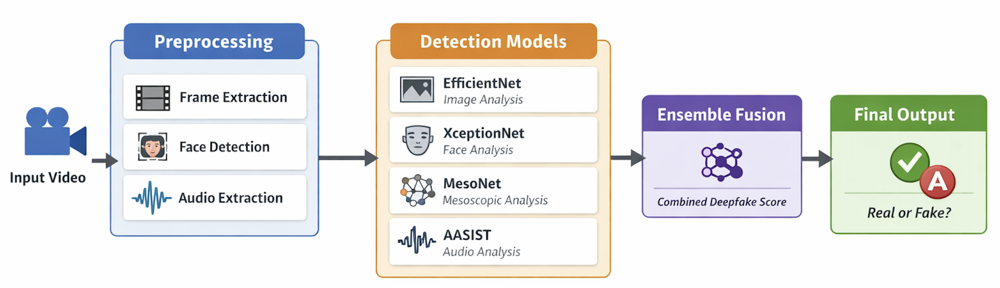

# AI Video Detection Pipeline

A **multimodal deepfake detection system** that analyzes both **video** and **audio** to classify media as **real or fake** using an ensemble of deep learning models.

---

## Overview

Deepfakes are becoming increasingly realistic and difficult to detect.  
This project addresses that challenge by combining multiple specialized models into a **single, robust ensemble system**.

Instead of relying on one model, we leverage **audio + visual signals** to improve detection accuracy and reliability.

---

## Demo

<!-- TODO: Add demo here (GIF or video link)
      -->
---

## Problem

Single-model deepfake detectors often fail when:

- Manipulations are subtle
- Only audio *or* video is altered
- The dataset differs from training data

---

## Solution

This system improves detection by:

- Analyzing **both audio and video**
- Combining multiple specialized models
- Producing a **more reliable final prediction**

---

## Features

- Video-based detection (EfficientNet, XceptionNet, MesoNet)
- Audio spoof detection (AASIST)
- Ensemble fusion (mean, voting, stacking)
- FastAPI backend
- Web interface for uploading videos

---

## System Architecture



The system separates an input video into audio and visual streams, processes each stream with specialized models, and combines the outputs into a final deepfake prediction.

---

## Quick Start

```bash
git clone https://github.com/utmgdsc/AI-Video-Detection
cd AI-Video-Detection
```

### Install dependencies

```bash
pip install -r backend/requirements.txt
cd frontend
npm install
```

---

## Model Weights

Download pretrained weights and place in `weights/`:

| Model | Download from | Place in |
|-------|--------------|----------|
| XceptionNet | [https://drive.google.com/drive/folders/1GNtk3hLq6sUGZCGx8fFttvyNYH8nrQS8] | `weights/xception.pth` |
| EfficientNet | [https://github.com/umitkacar/multimodal-deepfake-detector] | `weights/efficientnet.pth` |
| MesoNet | [https://github.com/DariusAf/MesoNet/tree/master/weights] | `weights/mesonet.pth` |
| AASIST | [https://github.com/clovaai/aasist/blob/main/models/weights/AASIST.pth] | `weights/aasist.pth` |

---

## Running the App

### Start backend

```bash
export PYTHONPATH=.
python -m uvicorn backend.main:app --reload
```

### Start frontend

```bash
cd frontend
npm run dev
```

---
## Results

### Overall Performance

| Metric | Value |
|--------|-------|
| Best Accuracy | **84.8%** |
| Typical Accuracy | ~70% |

### Ensemble Comparison

| Method | Accuracy |
|--------|---------|
| Weighted Voting | 72.8% |
| Majority Voting | 71.2% |
| Stacking | 71.0% |
| Mean | 61.6% |

### Key Insights

- Combining audio + video improves robustness
- Ensemble reduces weaknesses of individual models
- Video models drive most performance
- Audio helps detect edge cases

---

## Limitations

- Performance drops on unseen datasets
- Audio model generalization is weaker
- Face detection failures affect results
- Not yet optimized for real-time use

---

## Project Structure

```
backend/
├── models/            # Model implementations and wrappers
│   ├── wrappers/      # Standardized interfaces for each model
│   │   ├── xception.py
│   │   ├── efficientnet.py
│   │   ├── mesonet.py
│   │   └── aasist.py
│   └── ...            # Model-specific code and weights
├── handlers/          # Audio and video processing pipeline
│   ├── audio_handler.py
│   ├── video_handler.py
│   ├── facial_analyzer.py
│   └── image_analyzer.py
├── preprocessing/     # Data preprocessing utilities
│   ├── video_processor.py
│   ├── audio_processor.py
│   └── image_processor.py
├── services/          # Core detection and inference logic
├── main.py            # Backend entry point (FastAPI app)
└── requirements.txt   # Backend dependencies

frontend/
├── src/               # React frontend source code
├── public/            # Static assets
└── package.json       # Frontend dependencies

docs/
├── models/            # Model documentation
├── datasets/          # Dataset notes and evaluation
└── meeting-notes/     # Project logs and progress tracking
```

This structure separates model implementations, preprocessing, and inference logic, allowing each component to be developed and tested independently while supporting easy integration into the overall pipeline.

---

## Resources

- [Google Drive Folder](https://drive.google.com/drive/folders/1iD2lBPm-zB8x6PrBZRFfvWOGQkOXwx4r?usp=drive_link)
- [Presentation Deck 1](https://docs.google.com/presentation/d/1j3rwMip1ntUX6QFJGsPpEAPUNxofB7W2/edit?usp=sharing&ouid=104927623345744943216&rtpof=true&sd=true)
- [Project Idea](PROJECT_IDEA.md)

---

## Documentation

Additional documentation is available in the `docs/` directory, including model-specific notes, dataset documentation, and meeting records.

| Folder | Description |
|--------|-------------|
| [docs/models/](docs/models/) | Model documentation (one folder per model) |
| [docs/datasets/](docs/datasets/) | Dataset evaluation and selection docs |
| [docs/weekly-plan.md](docs/weekly-plan.md) | Project roadmap and milestone checklist |
| [docs/meeting-notes/](docs/meeting-notes/) | Project log and meeting notes |
| [docs/templates/](docs/templates/) | Templates for model notes and setup guides |

### Model Folders

- [docs/models/xception/](docs/models/xception/) — XceptionNet
- [docs/models/efficientnet/](docs/models/efficientnet/) — EfficientNet
- [docs/models/mesonet/](docs/models/mesonet/) — MesoNet
- [docs/models/aasist/](docs/models/aasist/) — AASIST (audio-based)

## Project Notes

Meeting and progress notes are in [docs/meeting-notes/](docs/meeting-notes/).

## Contributors

- Laiba Khan
- Hung-Mao Wu
- Wei Lin
- Frank Bi
- Yousef Abdelhadi


