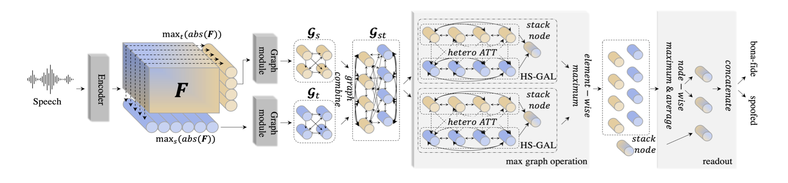

# AASIST — Model Notes

## What the model does (1–3 paragraphs)

AASIST (Audio Anti-Spoofing using Integrated Spectro-Temporal Graph Attention Networks) is an audio-based deepfake detection model designed to distinguish between bonafide (real) speech and spoofed or AI-generated speech. It operates directly on raw audio waveforms and learns discriminative temporal and spectral patterns that are difficult for synthetic speech systems to replicate.

The model takes a waveform input and produces a binary classification output indicating whether the audio is real or spoofed. In our implementation, the forward pass returns an intermediate embedding vector along with classification logits. These logits are converted into a softmax probability, and the probability of the “spoof” class is used as the model’s final score.

AASIST is highly relevant for AI video detection because many deepfake videos rely on synthetic or manipulated audio. Even when visual deepfake artifacts are subtle or well-hidden, audio artifacts often remain detectable. By adding AASIST as an audio-specific detector, we improve the robustness of our overall system beyond purely vision-based models.

## Paper / reference

- Paper title: AASIST: Audio Anti-Spoofing using Integrated Spectro-Temporal Graph Attention Networks
- Authors / year: Jung et al., 2021
- Link: https://arxiv.org/abs/2110.01200
- Key ideas:
  - Learn spoofing artifacts directly from raw waveforms
  - Model both temporal and spectral relationships using graph attention
  - Avoid reliance on handcrafted features such as MFCCs
- Architecture summary (high-level):
  - Raw waveform input
  - Convolutional front-end to extract low-level features
  - Spectro-temporal graph attention layers to model complex dependencies
  - Classification head producing logits for bonafide vs spoof

## What I learned (bullet points)

- Important details:
  - The model expects mono audio input shaped as `[1, T]`
  - The config file used in our repo is JSON-based, with model hyperparameters under `model_config`
  - The model’s forward pass returns `(embedding, logits)` rather than just logits
- Gotchas / assumptions:
  - Output logits are not probabilities and must be passed through softmax
  - Class ordering must be interpreted correctly; in our setup `[bonafide, spoof]`
  - The model is sensitive to audio preprocessing consistency (e.g., mono vs stereo)
- Strengths:
  - Strong performance on audio spoofing benchmarks
  - Works directly on raw audio without handcrafted features
  - Complements visual deepfake detectors well
- Weaknesses:
  - Only detects audio-based manipulation
  - Cannot detect silent or purely visual deepfakes
  - Performance depends on similarity between training data and real-world spoof types

## How it should be used in our project

- Expected preprocessing:
  - Extract audio from video using FFmpeg
  - Convert to WAV format
  - Convert stereo audio to mono if needed
- Expected input format:
  - WAV file
  - Loaded as a float tensor shaped `[1, T]`
- Metrics typically reported:
  - Equal Error Rate (EER)
  - min t-DCF (as reported in the original paper)
  - In our system, the model contributes a normalized spoof probability to the ensemble

## Screenshots / diagrams (optional)

## Open questions

- Questions to ask in weekly meeting:
- Things to verify:
